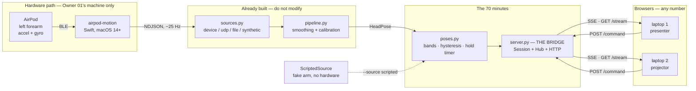
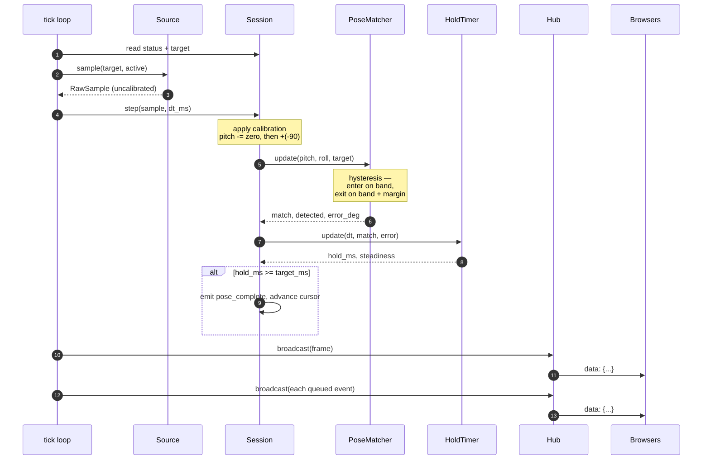
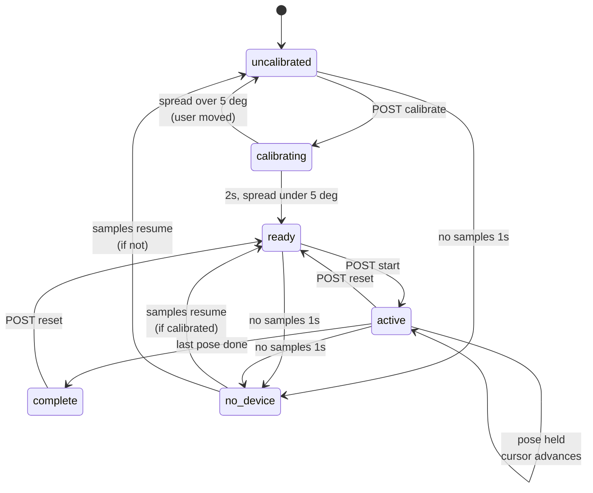
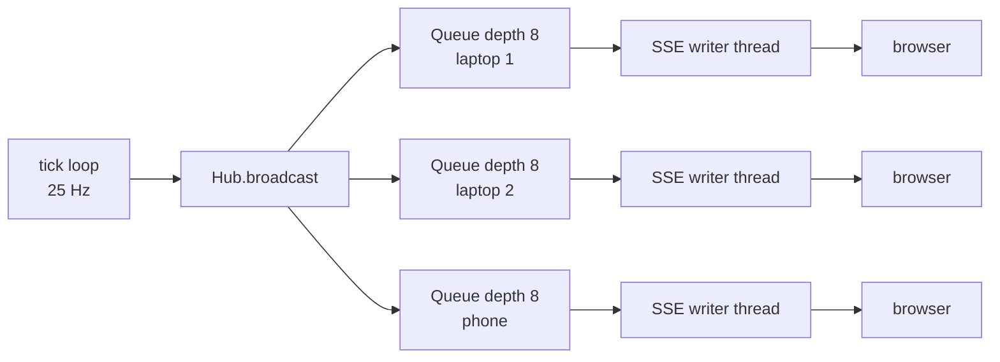

# The bridge — what it does, and everything that crosses it

`python/airpod_pose/server.py`. Owner: BRIDGE (02).

One sentence: **it turns a stream of forearm angles into a stream of session
state, and hands that to every browser that asks.**

It is authoritative — per D5 in [`01-wire-contract.md`](01-wire-contract.md), the
browser renders what the last frame said and owns nothing. That is why holding a
pose works identically on two laptops at once.

---

## 1. Node map

Who talks to whom, and who owns each box.



The dotted line is the important one. `--source scripted` replaces the entire
hardware path with a fake arm that walks itself through the sequence, so three
of four people never touch an AirPod all session.

---

## 2. Inputs and outputs

Everything that crosses the bridge boundary. There is nothing else.

### In

| From | How | Shape |
|------|-----|-------|
| Pose pipeline | in-process | `HeadPose` → `RawSample(t, pitch, roll, yaw)`, **uncalibrated** |
| Browser | `POST /command` | `{"cmd": "calibrate" \| "start" \| "skip" \| "reset"}` |
| `poses.json` | disk, re-read on every command | bands, hold times, labels |

### Out

| To | How | Shape |
|----|-----|-------|
| Browser | `GET /stream` (SSE) | `frame` — full snapshot, ~25 Hz |
| Browser | `GET /stream` (SSE) | `event` — one-shot transitions |
| Browser | `GET /` and `GET /<path>` | static files from `web/` |
| Browser | `POST /command` response | `200` accepted · `409` invalid for current status |

### HTTP surface — the whole thing

```
GET  /            → web/index.html
GET  /<path>      → web/<path>          (path-traversal guarded)
GET  /stream      → text/event-stream   (~25 Hz, never closes)
POST /command     → 200 | 409
```

One origin, one port. No CORS, nothing to configure.

---

## 3. What happens 25 times a second



Two things worth knowing about that loop:

**The frame is a full snapshot, always.** The renderer never accumulates — it
throws away the previous frame and draws this one. No sync bug is possible when
there is nothing to keep in sync.

**Events are fire-and-forget.** If a browser misses `pose_complete`, the next
frame still has the correct cursor. Events exist only so Experience can hang an
animation or a sound off a transition without Interface tracking edges.

---

## 4. Session state machine

The seven `status` values and every transition between them. This is also
Owner 04's screen inventory — each state needs a visual treatment.



`disconnected` is the eighth thing the UI shows and the server never sends it —
it means the browser lost the SSE stream. `EventSource` reconnects on its own.

### Guards worth knowing

- `start` before calibrating returns **409**. There is no zero to measure against.
- `skip` outside `active` returns **409**.
- Calibration **rejects itself** if the arm moved more than 5 deg during the
  window, and emits `calibration_rejected`. Better to ask again than to zero on
  a lie and have every angle be wrong for the rest of the demo.
- Every command re-reads `poses.json`, so bands can be retuned between demo runs
  with no restart.

---

## 5. Calibration, and the −90 trick

The one piece of arithmetic in here that will surprise someone.

CoreMotion's reference frame is arbitrary and not repeatable between runs, so
raw angles are meaningless. We zero on the hanging arm. But if we simply
subtracted the zero, Mountain would read 0 deg and overhead would read +180, and
every band would sit near a wraparound.

So the calibration defines the hanging arm as **−90 deg**:

```
pitch_out = (pitch_raw − pitch_zero) + MOUNTAIN_PITCH_DEG   # −90
roll_out  = wrap180(roll_raw − roll_zero)
yaw_out   = wrap180(yaw_raw − yaw_zero)
```

Which yields the convention the bands are written in, and the one the contract
states:

```
−90 deg   arm hanging      (Mountain)
  0 deg   arm level        (Warrior II)
+90 deg   arm overhead     (Upward Salute)
```

**Every angle on the wire is post-calibration.** Raw attitude never crosses the
boundary.

---

## 6. Fan-out, and what happens to a slow browser



Each subscriber gets a **bounded** queue. A browser that cannot keep up has
frames **dropped**, not buffered — the server's memory stays flat no matter how
badly a client misbehaves. Dropping costs nothing because every frame is a full
snapshot; the next one is already correct.

A browser that closes mid-write raises `BrokenPipeError`, which unsubscribes it.
That is normal and silent.

---

## 7. Running it

```bash
# no hardware — the default. A fake arm drives the whole sequence.
cd python && python -m airpod_pose.server

# real AirPods. Owner 01 only, macOS 14+, and `make bundle` FIRST
# or TCC returns zero samples with no error at all.
cd python && python -m airpod_pose.server --source device

# the demo safety net
cd python && python -m airpod_pose.server --source file --file ../data/golden.jsonl
```

Then open `http://localhost:8765`. Press **c** to calibrate, wait 2 s, press **s**
to start. **k** skips — build that reflex now, because it is what saves a demo
when a pose refuses to trigger in front of judges.

Other laptops point at `http://<that-machine>:8765`. The server binds `0.0.0.0`.

### Verified

Scripted path, end to end: calibrate → ready → start → active, 292 frames in
12 s (**24.3 Hz**), `pose_entered` / `pose_complete` firing, cursor advancing
through the sequence unattended.

### Not verified

`--source device`. It lazy-imports `PosePipeline` so non-Mac machines are never
blocked, but it has never run against hardware. **That is Owner 01's first
integration job**, and the most likely thing to need ten minutes at T+40.
